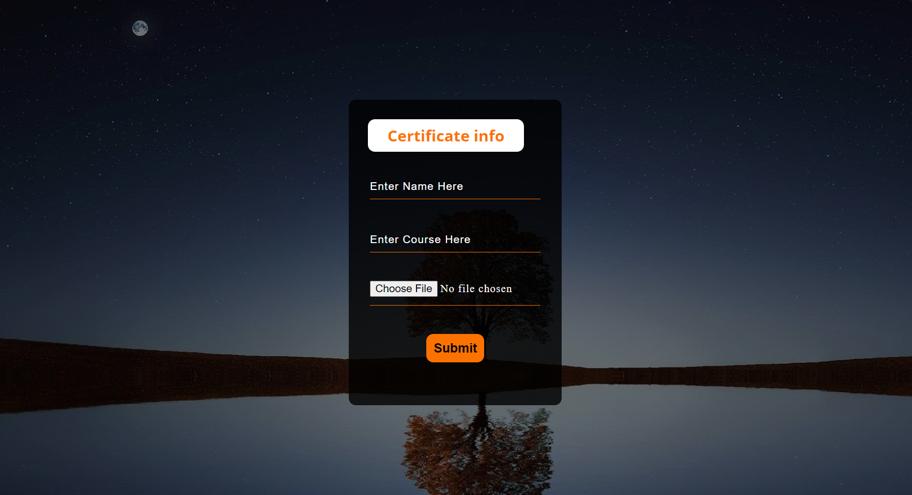
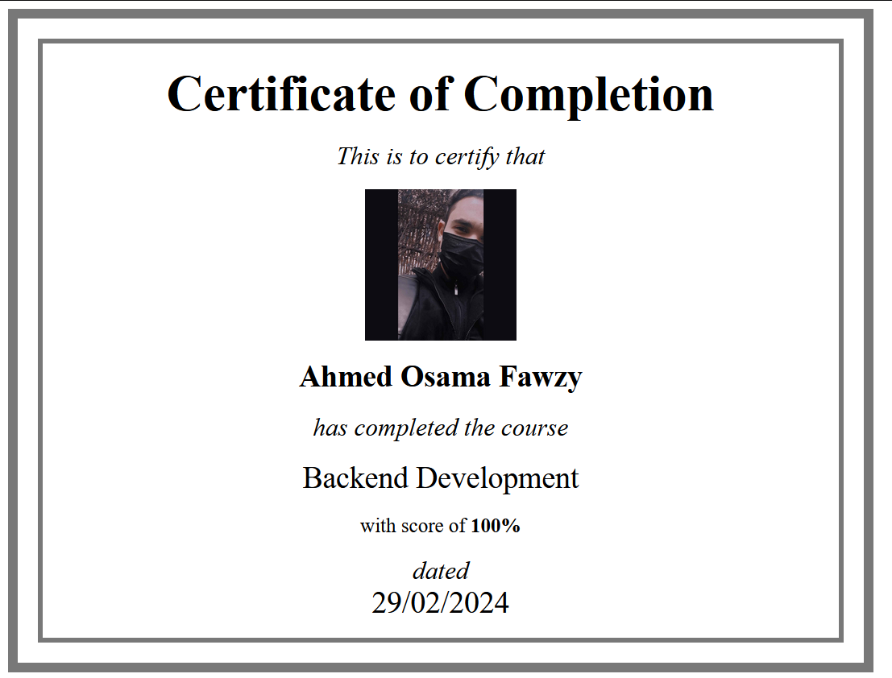

# Certificate Project

This Project designed to generate User Certificate

* [Certificate Form](#certificate-form)
* [Certificate Page](#certificate-page)
* [Technique](#technique)

## Certificate Form

That is the Page for get the certificate data (name, course, and image)

  

## Certificate Page

That is the Page for showing the certificate 

  

## technique
I used to make this project:
* HTML
* CSS
* PHP
* File System